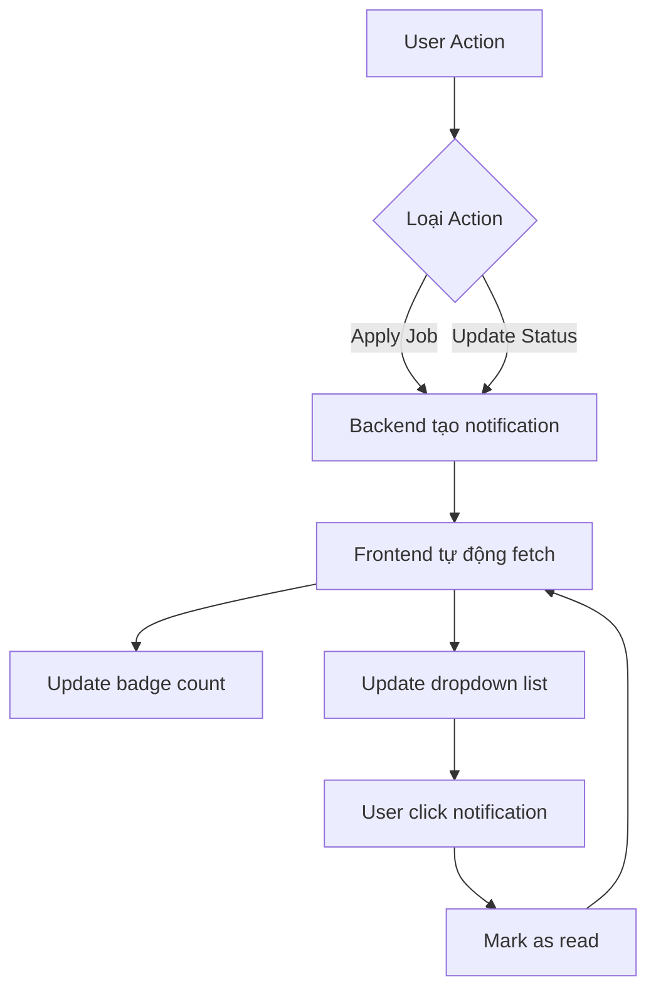

# 🔔 Hệ thống Thông báo - Notification System

## 📋 Mô tả

Hệ thống thông báo đầy đủ được tích hợp với backend API mới, hỗ trợ:
- ✅ Hiển thị badge số lượng thông báo chưa đọc
- ✅ Dropdown xem nhanh thông báo
- ✅ Trang quản lý thông báo chi tiết với phân trang
- ✅ Đánh dấu đã đọc (từng cái hoặc tất cả)
- ✅ Tự động refresh mỗi 30s
- ✅ Responsive design

## 🗂️ Cấu trúc files

```
src/
├── types/
│   └── notification.type.ts         # TypeScript interfaces
├── services/
│   └── notification.service.ts      # API service
├── modules/
│   └── notification/
│       ├── notification.route.tsx   # Route config
│       ├── NotificationPage.tsx     # Trang quản lý
│       └── NotificationDropdown.tsx # Dropdown component
├── layouts/
│   └── Header.tsx                   # Đã tích hợp dropdown
└── routes/
    └── index.tsx                    # Đã thêm routes
```

## 🚀 API Endpoints

Backend base URL: `http://localhost:8080/api/notifications`

### 1. **Lấy danh sách thông báo (có phân trang)**
```
GET /api/notifications?page=0&size=10
```

**Response:**
```typescript
{
  notifications: NotificationResponseDto[];
  currentPage: number;
  totalPages: number;
  totalItems: number;
  hasNext: boolean;
  hasPrevious: boolean;
}
```

### 2. **Lấy thông báo chưa đọc**
```
GET /api/notifications/unread
```

**Response:**
```typescript
{
  notifications: NotificationResponseDto[];
  unreadCount: number;
}
```

### 3. **Đếm số thông báo chưa đọc**
```
GET /api/notifications/unread-count
```

**Response:**
```typescript
{
  unreadCount: number;
}
```

### 4. **Đánh dấu một thông báo đã đọc**
```
PUT /api/notifications/{id}/read
```

### 5. **Đánh dấu tất cả đã đọc**
```
PUT /api/notifications/mark-all-read
```

## 📦 Data Structure

### NotificationResponseDto
```typescript
interface NotificationResponseDto {
  id: number;
  title: string;               // Tiêu đề thông báo
  message: string;             // Nội dung thông báo
  status: ApplicationStatus;   // PENDING, CV_PASSED, INTERVIEW, HIRED, REJECTED
  isRead: boolean;             // Đã đọc chưa
  createdAt: string;           // ISO datetime
  applicantId: number | null;  // ID đơn ứng tuyển
  jobTitle: string;            // Tên công việc
  companyName: string | null;  // Tên công ty
}
```

### ApplicationStatus Enum
```typescript
enum ApplicationStatus {
  PENDING = 'PENDING',       // Chờ xử lý
  CV_PASSED = 'CV_PASSED',   // CV đã duyệt
  INTERVIEW = 'INTERVIEW',   // Mời phỏng vấn
  HIRED = 'HIRED',           // Đã tuyển
  REJECTED = 'REJECTED'      // Từ chối
}
```

## 🎨 UI Components

### 1. **Header Notification Bell** (NotificationDropdown.tsx)
- Icon chuông với badge số lượng
- Dropdown hiển thị 5 thông báo gần nhất
- Nút "Đánh dấu tất cả đã đọc"
- Link đến trang quản lý thông báo
- Auto refresh mỗi 30s

### 2. **Notification Page** (NotificationPage.tsx)
- Danh sách đầy đủ thông báo
- Phân trang
- Status badges với màu sắc
- Thời gian hiển thị dạng relative (vd: "2 giờ trước")
- Nút đánh dấu đã đọc riêng lẻ
- Nút đánh dấu tất cả đã đọc

## 🎯 Cách sử dụng

### 1. **Xem thông báo trong Header**
- Click vào icon chuông ở Header
- Xem danh sách thông báo chưa đọc
- Click vào thông báo để đánh dấu đã đọc
- Click "Xem tất cả thông báo" để đến trang chi tiết

### 2. **Quản lý thông báo**
- Truy cập `/notifications`
- Xem tất cả thông báo với phân trang
- Đánh dấu từng thông báo đã đọc
- Đánh dấu tất cả đã đọc

## 🔧 Cấu hình

### Auto Refresh
Trong `NotificationDropdown.tsx`:
```typescript
refetchInterval: 30000, // Refresh mỗi 30s
```

Có thể thay đổi giá trị này để tăng/giảm tần suất refresh.

### Số lượng thông báo hiển thị trong Dropdown
Trong `NotificationDropdown.tsx`:
```typescript
notifications.slice(0, 5) // Hiển thị 5 thông báo
```

## 📝 Lưu ý

1. **Authentication**: Tất cả API cần Bearer token
2. **Permissions**: 
   - Employer nhận thông báo khi có ứng viên mới
   - Candidate nhận thông báo khi trạng thái đơn ứng tuyển thay đổi
3. **Real-time**: Hiện tại dùng polling (30s), có thể nâng cấp lên WebSocket sau

## 🧪 Testing

### Test với Postman
Import file: `Notification_API_Postman_Collection.json` (đã có từ backend)

### Test scenarios
1. ✅ Apply job → Kiểm tra thông báo "Ứng tuyển thành công"
2. ✅ Employer update status → Kiểm tra thông báo cho candidate
3. ✅ Đánh dấu đã đọc → Kiểm tra badge count giảm
4. ✅ Pagination → Kiểm tra phân trang hoạt động

## 🐛 Troubleshooting

### Badge count không cập nhật
- Check network tab xem API có gọi thành công không
- Kiểm tra `refetchInterval` có hoạt động không
- Clear cache và refresh lại trang

### Thông báo không hiển thị
- Check token có hợp lệ không
- Kiểm tra backend có return đúng data không
- Check console log có lỗi gì không

### Styling bị lỗi
- Đảm bảo Tailwind CSS đã được config đúng
- Check class conflicts với CSS cũ

## 📚 Dependencies

- `@tanstack/react-query` - Data fetching & caching
- `@headlessui/react` - Dropdown component
- `lucide-react` - Icons
- `date-fns` - Format thời gian
- `axios` - HTTP client

## 🔄 Workflow



## 📞 Hỗ trợ

Nếu có vấn đề, kiểm tra:
1. Backend API có chạy không (`http://localhost:8080`)
2. Token có hợp lệ không
3. Network tab có lỗi gì không
4. Console log có error gì không
